# System Architecture Addendum: Phase 4+ Enhancements

**Version:** 2.0
**Last Updated:** 2026-01-24
**Base Document:** `architecture.md` v1.1
**Status:** Active Development

---

## Table of Contents

1. [Phase 4+ Architecture Overview](#phase-4-architecture-overview)
2. [Authentication Architecture](#authentication-architecture)
3. [Admin Portal Architecture](#admin-portal-architecture)
4. [Enhanced Scoring Architecture](#enhanced-scoring-architecture)
5. [User Workspace Architecture](#user-workspace-architecture)
6. [Database Schema Extensions](#database-schema-extensions)
7. [API Architecture Phase 4+](#api-architecture-phase-4)
8. [Real-Time Communication Patterns](#real-time-communication-patterns)
9. [Security Architecture](#security-architecture)
10. [Performance Architecture](#performance-architecture)

---

## Phase 4+ Architecture Overview

### System Context Diagram (Updated)

```mermaid
graph TB
    subgraph "Frontend (Next.js)"
        User[👤 User]
        Admin[🔧 Admin]
        NextJS[Next.js 16.1.3<br/>App Router]
        ClerkUI[Clerk UI Components]
    end

    subgraph "Authentication Layer"
        Clerk[Clerk Service<br/>JWT Provider]
    end

    subgraph "Backend (FastAPI)"
        API[FastAPI<br/>REST API]
        Auth[Auth Middleware<br/>JWT Verification]
        UserRoutes[User Routes]
        AdminRoutes[Admin Routes]
        InsightRoutes[Insight Routes]
        SSE[SSE Stream<br/>Admin Events]
    end

    subgraph "Data Layer"
        DB[(PostgreSQL<br/>v0.2 Schema)]
        Redis[(Redis<br/>State + Cache)]
    end

    subgraph "Background Workers"
        Scrapers[Scraper Workers]
        Analyzers[Analyzer Workers]
    end

    subgraph "External Services"
        LLM[Claude 3.5 Sonnet<br/>Anthropic API]
        Firecrawl[Firecrawl API]
    end

    User --> NextJS
    Admin --> NextJS
    NextJS --> ClerkUI
    ClerkUI --> Clerk
    NextJS --> API
    API --> Auth
    Auth --> Clerk

    Auth --> UserRoutes
    Auth --> AdminRoutes
    Auth --> InsightRoutes

    UserRoutes --> DB
    AdminRoutes --> DB
    AdminRoutes --> Redis
    AdminRoutes --> SSE
    InsightRoutes --> DB

    SSE --> Admin

    Scrapers --> Redis
    Analyzers --> Redis
    Scrapers --> LLM
    Analyzers --> LLM
    Scrapers --> Firecrawl

    Scrapers --> DB
    Analyzers --> DB

    style Clerk fill:#6366f1
    style Auth fill:#f59e0b
    style SSE fill:#10b981
    style Redis fill:#ef4444
```



### Phase 4 Architectural Layers

```
┌─────────────────────────────────────────────┐
│  Presentation Layer (Next.js)               │
│  - Public Pages (Home, Insights List)       │
│  - Protected Pages (Workspace, Admin)       │
│  - Clerk UI Components                      │
└─────────────────────────────────────────────┘
                    ↓
┌─────────────────────────────────────────────┐
│  Authentication Layer                       │
│  - Clerk JWT Verification                   │
│  - User Creation/Sync                       │
│  - Role-Based Authorization                 │
└─────────────────────────────────────────────┘
                    ↓
┌─────────────────────────────────────────────┐
│  API Layer (FastAPI)                        │
│  - Public Endpoints (no auth)               │
│  - User Endpoints (user auth)               │
│  - Admin Endpoints (admin auth)             │
│  - SSE Streaming (real-time)                │
└─────────────────────────────────────────────┘
                    ↓
┌─────────────────────────────────────────────┐
│  Business Logic Layer                       │
│  - User Management Service                  │
│  - Insight Service (Enhanced Scoring)       │
│  - Admin Service (Agent Control)            │
│  - Analytics Service                        │
└─────────────────────────────────────────────┘
                    ↓
┌─────────────────────────────────────────────┐
│  Data Access Layer                          │
│  - PostgreSQL (User, Insight, Admin data)   │
│  - Redis (Agent State, Cache, Sessions)     │
└─────────────────────────────────────────────┘
                    ↓
┌─────────────────────────────────────────────┐
│  Worker Layer                               │
│  - Scrapers (Redis State Check)             │
│  - Analyzers (Enhanced Scoring)             │
│  - Background Jobs (Metrics, Backfill)      │
└─────────────────────────────────────────────┘
```

---

## Authentication Architecture

### JWT-Based Authentication Flow


### Token Storage Strategy

**Frontend Token Management:**

| Storage Option | Pros | Cons | Our Choice |
|----------------|------|------|------------|
| localStorage | Simple, survives refresh | Vulnerable to XSS | ❌ No |
| sessionStorage | Auto-clears on close | Lost on refresh | ❌ No |
| httpOnly Cookie | XSS-safe, auto-sent | Requires CSRF protection | ✅ Yes |
| In-memory | Most secure | Lost on refresh | ❌ No |

**Implementation:**

```typescript
// Clerk handles token storage automatically (httpOnly cookies)
// Token is automatically included in requests via Authorization header

import { auth } from "@clerk/nextjs/server";

export async function getServerSideProps(context) {
  const { userId } = await auth();

  if (!userId) {
    return { redirect: { destination: "/sign-in" } };
  }

  // userId available for API calls
  return { props: { userId } };
}
```

### Authorization Layers

```python
# backend/app/api/deps.py

from enum import Enum

class UserRole(str, Enum):
    USER = "user"
    MODERATOR = "moderator"
    ADMIN = "admin"

# Dependency: Require authentication
async def get_current_user(request: Request) -> User:
    """Verify JWT and return user (raises 401 if invalid)."""
    pass

# Dependency: Require admin role
async def require_admin(user: User = Depends(get_current_user)) -> User:
    """Verify user is admin (raises 403 if not)."""
    admin_record = await db.execute(
        select(AdminUser).where(AdminUser.user_id == user.id)
    )
    if not admin_record.scalar_one_or_none():
        raise HTTPException(403, "Admin access required")

    return user

# Usage
@router.get("/api/admin/dashboard")
async def admin_dashboard(admin: User = Depends(require_admin)):
    # Only admins can access
    pass

@router.get("/api/users/me")
async def get_profile(user: User = Depends(get_current_user)):
    # Any authenticated user can access
    pass

@router.get("/api/insights")
async def list_insights():
    # Public endpoint (no auth required)
    pass
```

### Session Management

**Clerk Session Lifecycle:**

```
User Sign In
    ↓
Clerk creates session (JWT token)
    ↓
Token stored in httpOnly cookie (expires in 1 hour)
    ↓
Frontend automatically refreshes token (before expiry)
    ↓
Backend verifies token on each request
    ↓
User Sign Out → Clerk invalidates session
```

**Token Refresh:**
- Automatic: Clerk SDK handles refresh before expiry
- Manual: User can force refresh via `getToken({ skipCache: true })`
- Fallback: If refresh fails, user redirected to sign-in

---

## Admin Portal Architecture

### Real-Time Update Mechanism (SSE)

**Architecture Decision:**
- ✅ Server-Sent Events (SSE) - Chosen
- ❌ WebSocket - Rejected (overkill for one-way streaming)
- ❌ Polling - Rejected (inefficient, 30-60s delay)

**SSE Implementation:**


**Backend SSE Implementation:**

```python
# backend/app/api/routes/admin.py
from sse_starlette.sse import EventSourceResponse
import asyncio
import json

@router.get("/admin/events")
async def admin_event_stream(
    admin: User = Depends(require_admin),
    db: AsyncSession = Depends(get_db),
):
    """Stream admin dashboard updates via Server-Sent Events."""

    async def event_generator():
        while True:
            try:
                # Gather metrics
                metrics = await gather_admin_metrics(db)

                # Send update
                yield {
                    "event": "metrics_update",
                    "data": json.dumps(metrics),
                    "retry": 5000,  # Reconnect after 5s if disconnected
                }

                # Wait 5 seconds
                await asyncio.sleep(5)

            except asyncio.CancelledError:
                # Client disconnected
                logger.info("Admin client disconnected from SSE")
                break
            except Exception as e:
                logger.error(f"SSE error: {e}")
                # Send error event
                yield {
                    "event": "error",
                    "data": json.dumps({"error": str(e)}),
                }
                await asyncio.sleep(5)

    return EventSourceResponse(event_generator())


async def gather_admin_metrics(db: AsyncSession) -> dict:
    """Gather all metrics for admin dashboard."""

    # Agent states from Redis
    agent_states = {}
    for agent in ["reddit_scraper", "product_hunt_scraper", "trends_scraper", "analyzer"]:
        state = await redis.get(f"agent_state:{agent}")
        agent_states[agent] = state.decode() if state else "running"

    # Last 10 execution logs
    logs = await db.execute(
        select(AgentExecutionLog)
        .order_by(AgentExecutionLog.created_at.desc())
        .limit(10)
    )
    recent_logs = [log.to_dict() for log in logs.scalars().all()]

    # LLM cost today
    cost_result = await db.execute(
        select(func.sum(SystemMetric.metric_value))
        .where(
            SystemMetric.metric_type == "llm_cost",
            SystemMetric.recorded_at >= func.now() - text("interval '1 day'")
        )
    )
    llm_cost_today = cost_result.scalar_one_or_none() or 0.0

    # Insights pending review
    pending_result = await db.execute(
        select(func.count())
        .select_from(Insight)
        .where(Insight.admin_status == "pending")
    )
    pending_count = pending_result.scalar_one()

    return {
        "agent_states": agent_states,
        "recent_logs": recent_logs,
        "llm_cost_today": float(llm_cost_today),
        "pending_insights": pending_count,
        "timestamp": datetime.now().isoformat(),
    }
```

**Frontend SSE Consumer:**

```typescript
// frontend/app/admin/page.tsx
"use client";

import { useEffect, useState } from "react";
import { useAuth } from "@clerk/nextjs";

interface AdminMetrics {
  agent_states: Record<string, string>;
  recent_logs: any[];
  llm_cost_today: number;
  pending_insights: number;
  timestamp: string;
}

export default function AdminDashboard() {
  const { getToken } = useAuth();
  const [metrics, setMetrics] = useState<AdminMetrics | null>(null);
  const [connectionStatus, setConnectionStatus] = useState<"connecting" | "connected" | "disconnected">("connecting");

  useEffect(() => {
    let eventSource: EventSource | null = null;

    async function connectSSE() {
      const token = await getToken();

      // Create EventSource connection with auth token
      eventSource = new EventSource(`/api/admin/events?token=${token}`);

      eventSource.onopen = () => {
        console.log("SSE connected");
        setConnectionStatus("connected");
      };

      eventSource.addEventListener("metrics_update", (event) => {
        const data = JSON.parse(event.data);
        setMetrics(data);
      });

      eventSource.addEventListener("error", (event) => {
        console.error("SSE error:", event);
        setConnectionStatus("disconnected");
      });

      eventSource.onerror = (error) => {
        console.error("SSE connection failed:", error);
        setConnectionStatus("disconnected");
        eventSource?.close();

        // Reconnect after 5 seconds
        setTimeout(connectSSE, 5000);
      };
    }

    connectSSE();

    // Cleanup on unmount
    return () => {
      eventSource?.close();
    };
  }, [getToken]);

  if (!metrics) {
    return <div>Loading dashboard...</div>;
  }

  return (
    <div>
      <div className="flex items-center gap-2 mb-4">
        <h1 className="text-3xl font-bold">Admin Dashboard</h1>
        <span className={`px-2 py-1 text-xs rounded ${
          connectionStatus === "connected" ? "bg-green-100 text-green-800" :
          connectionStatus === "connecting" ? "bg-yellow-100 text-yellow-800" :
          "bg-red-100 text-red-800"
        }`}>
          {connectionStatus === "connected" ? "● Live" :
           connectionStatus === "connecting" ? "● Connecting..." :
           "● Disconnected"}
        </span>
      </div>

      {/* Agent Status Cards */}
      <div className="grid gap-4 md:grid-cols-2 lg:grid-cols-4">
        {Object.entries(metrics.agent_states).map(([agent, state]) => (
          <AgentStatusCard key={agent} agent={agent} state={state} />
        ))}
      </div>

      {/* LLM Cost */}
      <div className="mt-6">
        <div className="text-sm text-muted-foreground">LLM Cost Today</div>
        <div className="text-3xl font-bold">${metrics.llm_cost_today.toFixed(2)}</div>
      </div>

      {/* Recent Logs */}
      <div className="mt-6">
        <h2 className="text-xl font-bold mb-4">Recent Executions</h2>
        <ExecutionLogTable logs={metrics.recent_logs} />
      </div>

      {/* Last updated timestamp */}
      <div className="text-xs text-muted-foreground mt-4">
        Last updated: {new Date(metrics.timestamp).toLocaleTimeString()}
      </div>
    </div>
  );
}
```

### Agent Control Architecture

**Redis-Based State Machine:**

```
┌──────────────┐
│ Agent States │
│ (Redis Keys) │
└──────────────┘
        ↓
agent_state:reddit_scraper = "running" | "paused"
agent_state:analyzer = "running" | "paused"

┌──────────────────────────────────────┐
│ State Transitions                    │
├──────────────────────────────────────┤
│ running → paused   (via POST /pause) │
│ paused → running   (via POST /resume)│
│ * → triggered      (via POST /trigger│
└──────────────────────────────────────┘

┌──────────────────────────────────────┐
│ Worker Behavior                      │
├──────────────────────────────────────┤
│ Before each task execution:          │
│   1. Read agent_state:{agent} from Redis│
│   2. If "paused" → skip, return early│
│   3. If "running" → proceed          │
│   4. Log execution to database       │
└──────────────────────────────────────┘
```

**Worker Implementation:**

```python
# backend/app/tasks/scraping_tasks.py

async def scrape_reddit_task(ctx):
    """Reddit scraping task with state management."""
    redis = ctx["redis"]
    db = ctx["db"]

    # Check agent state
    state = await redis.get("agent_state:reddit_scraper")
    if state == b"paused":
        logger.info("Reddit scraper is paused, skipping execution")
        return {"status": "skipped", "reason": "Agent paused by admin"}

    # Log execution start
    log = AgentExecutionLog(
        agent_type="scraper",
        source="reddit",
        status="running",
        started_at=datetime.now(),
    )
    db.add(log)
    await db.commit()

    try:
        # Perform scraping
        scraper = RedditScraper()
        results = await scraper.scrape()

        # Log success
        log.status = "completed"
        log.completed_at = datetime.now()
        log.duration_ms = (log.completed_at - log.started_at).total_seconds() * 1000
        log.items_processed = len(results)
        await db.commit()

        logger.info(f"Reddit scraper completed: {len(results)} items")
        return {"status": "completed", "items": len(results)}

    except Exception as e:
        # Log failure
        log.status = "failed"
        log.completed_at = datetime.now()
        log.duration_ms = (log.completed_at - log.started_at).total_seconds() * 1000
        log.error_message = str(e)
        await db.commit()

        logger.error(f"Reddit scraper failed: {e}")
        raise
```

**Admin API Control:**

```python
# backend/app/api/routes/admin.py

@router.post("/admin/agents/{agent_type}/pause")
async def pause_agent(
    agent_type: str,
    admin: User = Depends(require_admin),
    db: AsyncSession = Depends(get_db),
):
    """Pause agent execution."""
    # Validate agent type
    valid_agents = ["reddit_scraper", "product_hunt_scraper", "trends_scraper", "analyzer"]
    if agent_type not in valid_agents:
        raise HTTPException(400, f"Invalid agent type. Must be one of: {valid_agents}")

    # Set state to paused
    await redis.set(f"agent_state:{agent_type}", "paused")

    # Log admin action (audit trail)
    await log_admin_action(
        admin_user_id=admin.id,
        action="pause_agent",
        target=agent_type,
        metadata={"timestamp": datetime.now().isoformat()}
    )

    logger.info(f"Agent {agent_type} paused by admin {admin.email}")

    return {
        "status": "paused",
        "agent_type": agent_type,
        "paused_by": admin.email,
        "timestamp": datetime.now().isoformat(),
    }


@router.post("/admin/agents/{agent_type}/resume")
async def resume_agent(
    agent_type: str,
    admin: User = Depends(require_admin),
):
    """Resume agent execution."""
    await redis.set(f"agent_state:{agent_type}", "running")

    await log_admin_action(
        admin_user_id=admin.id,
        action="resume_agent",
        target=agent_type,
    )

    logger.info(f"Agent {agent_type} resumed by admin {admin.email}")

    return {"status": "running", "agent_type": agent_type}


@router.post("/admin/agents/{agent_type}/trigger")
async def trigger_agent(
    agent_type: str,
    admin: User = Depends(require_admin),
):
    """Manually trigger agent execution (out of schedule)."""
    from app.worker import arq_redis

    # Map agent_type to task function
    task_map = {
        "reddit_scraper": "scrape_reddit_task",
        "product_hunt_scraper": "scrape_product_hunt_task",
        "trends_scraper": "scrape_trends_task",
        "analyzer": "analyze_signals_task",
    }

    if agent_type not in task_map:
        raise HTTPException(400, f"Invalid agent type")

    # Enqueue job
    job = await arq_redis.enqueue_job(
        task_map[agent_type],
        _queue_name="startinsight"
    )

    await log_admin_action(
        admin_user_id=admin.id,
        action="trigger_agent",
        target=agent_type,
        metadata={"job_id": job.job_id}
    )

    logger.info(f"Agent {agent_type} triggered by admin {admin.email}, job_id={job.job_id}")

    return {
        "status": "triggered",
        "agent_type": agent_type,
        "job_id": job.job_id,
        "triggered_by": admin.email,
    }
```

---

## Enhanced Scoring Architecture

### Multi-Dimensional Scoring Pipeline

**Architecture Decision: Single-Prompt Serial Approach**


**Cost vs Speed Analysis:**

| Approach | LLM Calls | Cost per Insight | Latency | Complexity | Our Choice |
|----------|-----------|------------------|---------|------------|------------|
| **Single-Prompt Serial** | 1 | $0.045 | 3-5s | Low | ✅ Yes |
| **Multi-Prompt Parallel** | 4 | $0.180 | 2-3s | High | ❌ No |
| **Hybrid** (2 calls) | 2 | $0.090 | 2-4s | Medium | Future |

**Scoring Dimensions:**

```python
# 8-Dimensional Scoring Model

class ScoreDimensions:
    """All scores are 1-10 integers."""

    # Core Opportunity Metrics
    opportunity_score: int      # Market size (1=tiny, 10=massive)
    problem_score: int          # Pain severity (1=mild, 10=existential)
    feasibility_score: int      # Technical ease (1=impossible, 10=trivial)
    why_now_score: int          # Market timing (1=wrong time, 10=perfect)

    # Business Fit Metrics
    revenue_potential: str      # $, $$, $$$, $$$$
    execution_difficulty: int   # Complexity (1=weekend, 10=years)
    go_to_market_score: int     # Distribution (1=hard sales, 10=viral)
    founder_fit_score: int      # Skill req (1=PhD needed, 10=anyone)

class AnalysisFrameworks:
    """Advanced frameworks for deeper insight."""

    # 4-Tier Pricing Model (IdeaBrowser parity)
    value_ladder: list[ValueLadderTier]  # Lead Magnet → Frontend → Core → Backend

    # Market Analysis
    market_gap_analysis: str    # Where competitors fail (200-300 words)
    why_now_analysis: str       # Why this is timely (200-300 words)

    # Validation Evidence
    proof_signals: list[ProofSignal]  # 3-5 evidence pieces

    # Actionable Plan
    execution_plan: list[ExecutionStep]  # 5-7 launch steps
```

**Enhanced Analyzer Agent:**

```python
# backend/app/agents/enhanced_analyzer.py

from pydantic_ai import Agent
from pydantic import BaseModel, Field

# Define enhanced schema (see implementation-plan-phase4-detailed.md for full schema)

ENHANCED_ANALYSIS_PROMPT = """
You are a startup idea validation expert analyzing market signals.

Analyze the following signal and provide comprehensive 8-dimension scoring:

**Signal:** {raw_content}
**Source:** {source}

## Output Requirements:

1. **Opportunity Score (1-10):** Market size
   - 1-3: <$10M TAM
   - 4-6: $10M-$1B
   - 7-9: $1B-$100B
   - 10: >$100B

2. **Problem Score (1-10):** Pain severity
   - 1-3: Nice-to-have
   - 4-6: Willing to pay
   - 7-9: Actively searching
   - 10: Existential pain

3. **Feasibility Score (1-10):** Technical difficulty
   - 1-3: Requires breakthrough tech
   - 4-6: Challenging but doable
   - 7-9: Can build with current tools
   - 10: No-code solution

4. **Why Now Score (1-10):** Market timing
   - 1-3: Too early/late
   - 4-6: Okay timing
   - 7-9: Good timing
   - 10: Perfect inflection point

5. **Revenue Potential:** $ (low), $$ (medium), $$$ (high), $$$$ (very high)

6. **Execution Difficulty (1-10):** Complexity
   - 1-3: Weekend project
   - 4-6: 3-6 months
   - 7-9: 1-2 years
   - 10: Multi-year, exceptional team

7. **Go-To-Market Score (1-10):** Distribution ease
   - 1-3: Enterprise sales
   - 4-6: SMB sales
   - 7-9: Self-serve
   - 10: Viral/PLG

8. **Founder Fit Score (1-10):** Skill requirements
   - 1-3: PhD + 10 years experience
   - 4-6: Domain knowledge helpful
   - 7-9: Generalist can learn
   - 10: No special knowledge

## Value Ladder Framework:

Design 4-tier pricing for this business:
- **Lead Magnet (Free):** What free tool captures emails?
- **Frontend ($9-$29/mo):** Entry product
- **Core ($49-$99/mo):** Main product
- **Backend ($299+/mo):** Premium offering

Provide specific examples for THIS idea.

## Market Gap Analysis:

Write 200-300 words on where current solutions fail.

## Why Now Analysis:

Write 200-300 words on why this is timely (technology enablers, market shifts, trends).

## Proof Signals:

List 3-5 validation evidence pieces:
- Signal Type: (search_trend, competitor_growth, community_discussion)
- Description: Evidence description
- Source: Where found
- Confidence: Low/Medium/High

## Execution Plan:

Provide 5-7 actionable steps:
- Step Number, Title, Description
- Estimated Time
- Resources Needed

Return ONLY valid JSON matching EnhancedInsightSchema.
"""

# Agent initialization
enhanced_analyzer = Agent(
    model="claude-3-5-sonnet-20241022",
    result_type=EnhancedInsightSchema,
    system_prompt=ENHANCED_ANALYSIS_PROMPT,
)

async def analyze_signal_enhanced(raw_signal: RawSignal) -> Insight:
    """Analyze signal with enhanced 8-dimension scoring."""

    # Run agent
    result = await enhanced_analyzer.run(
        raw_content=raw_signal.content,
        source=raw_signal.source,
        url=raw_signal.url,
    )

    # Validate result
    if not result.data:
        raise ValueError("Enhanced analysis failed: No data returned")

    # Convert to Insight model
    insight = Insight(
        raw_signal_id=raw_signal.id,
        title=result.data.title,
        problem_statement=result.data.problem_statement,
        proposed_solution=result.data.proposed_solution,
        market_size_estimate=result.data.market_size_estimate,
        relevance_score=result.data.relevance_score,
        competitor_analysis=result.data.competitor_analysis,

        # Enhanced scores
        opportunity_score=result.data.opportunity_score,
        problem_score=result.data.problem_score,
        feasibility_score=result.data.feasibility_score,
        why_now_score=result.data.why_now_score,
        revenue_potential=result.data.revenue_potential,
        execution_difficulty=result.data.execution_difficulty,
        go_to_market_score=result.data.go_to_market_score,
        founder_fit_score=result.data.founder_fit_score,

        # Frameworks (store as JSONB)
        value_ladder=[tier.model_dump() for tier in result.data.value_ladder],
        market_gap_analysis=result.data.market_gap_analysis,
        why_now_analysis=result.data.why_now_analysis,
        proof_signals=[signal.model_dump() for signal in result.data.proof_signals],
        execution_plan=[step.model_dump() for step in result.data.execution_plan],
    )

    return insight
```

### Cost Tracking & Optimization

**LLM Cost Calculation:**

```python
# backend/app/monitoring/llm_costs.py

class LLMCostTracker:
    """Track LLM API costs with token-level granularity."""

    # Pricing (per 1M tokens)
    COSTS = {
        "claude-3-5-sonnet-20241022": {
            "input": 3.00,    # $3/M input tokens
            "output": 15.00,  # $15/M output tokens
        },
        "claude-3-haiku-20240307": {
            "input": 0.25,    # $0.25/M input tokens
            "output": 1.25,   # $1.25/M output tokens
        },
    }

    @staticmethod
    def calculate_cost(model: str, input_tokens: int, output_tokens: int) -> float:
        """Calculate cost in USD."""
        if model not in LLMCostTracker.COSTS:
            logger.warning(f"Unknown model: {model}, using Sonnet pricing")
            model = "claude-3-5-sonnet-20241022"

        pricing = LLMCostTracker.COSTS[model]

        input_cost = (input_tokens / 1_000_000) * pricing["input"]
        output_cost = (output_tokens / 1_000_000) * pricing["output"]

        return input_cost + output_cost

    @staticmethod
    async def track_llm_call(
        db: AsyncSession,
        model: str,
        input_tokens: int,
        output_tokens: int,
        task_type: str,  # "insight_analysis", "custom_research", etc.
    ):
        """Track LLM call for cost analysis."""
        cost = LLMCostTracker.calculate_cost(model, input_tokens, output_tokens)

        # Store metric
        metric = SystemMetric(
            metric_type="llm_cost",
            metric_value=cost,
            dimensions={
                "model": model,
                "task_type": task_type,
                "input_tokens": input_tokens,
                "output_tokens": output_tokens,
            }
        )
        db.add(metric)
        await db.commit()

        logger.info(f"LLM call cost: ${cost:.4f} ({model}, {input_tokens}+{output_tokens} tokens)")

        # Check daily budget
        daily_cost = await get_daily_llm_cost(db)
        if daily_cost > 50.00:
            await send_budget_alert(daily_cost)
```

**Optimization Strategies:**

1. **Prompt Compression:** Use shortest effective prompts
2. **Response Caching:** Cache common analyses for 24 hours
3. **Model Selection:** Use Haiku for simple tasks (10x cheaper)
4. **Batch Processing:** Analyze multiple signals in single call (future)

---

## User Workspace Architecture

### Data Isolation Strategy

**User Data Segregation:**

```sql
-- All user data has user_id foreign key with CASCADE delete
-- User deletes account → all related data deleted automatically

saved_insights (user_id FK)
user_ratings (user_id FK)
insight_interactions (user_id FK)
custom_analyses (user_id FK)  -- Phase 5

-- Example: User deletion cascades
DELETE FROM users WHERE id = 'user-uuid';
-- Automatically deletes:
--   - saved_insights (via ON DELETE CASCADE)
--   - user_ratings (via ON DELETE CASCADE)
--   - insight_interactions (via ON DELETE CASCADE)
```

**Query Performance:**

```python
# Efficient user data queries

# Good: Use composite index
query = (
    select(SavedInsight)
    .where(SavedInsight.user_id == user_id)
    .order_by(SavedInsight.saved_at.desc())
    .limit(20)
)
# Uses: idx_saved_insights_user_saved (user_id, saved_at DESC)

# Bad: Full table scan
query = (
    select(SavedInsight)
    .order_by(SavedInsight.saved_at.desc())
    .limit(20)
)
# No user filter → scans entire table
```

### Workspace Features Architecture

**Status Tracking State Machine:**

```
┌─────────────────────────────────────┐
│ Insight Status Lifecycle            │
├─────────────────────────────────────┤
│                                     │
│    [New] ──┬──→ [Interested]       │
│            │                        │
│            ├──→ [Saved]             │
│            │                        │
│            ├──→ [Building] ◄─ Claimed│
│            │                        │
│            └──→ [Not Interested]    │
│                                     │
│ Transitions allowed:                │
│ - Any → Interested                  │
│ - Any → Saved                       │
│ - Any → Building (sets claimed_at)  │
│ - Any → Not Interested              │
│ - Any → null (remove status)        │
└─────────────────────────────────────┘
```

**Implementation:**

```python
# backend/app/api/routes/users.py

@router.post("/insights/{insight_id}/claim")
async def claim_idea(
    insight_id: UUID,
    user: User = Depends(get_current_user),
    db: AsyncSession = Depends(get_db),
):
    """Mark insight as 'building' (claimed by user)."""

    # Check if insight exists
    insight = await db.get(Insight, insight_id)
    if not insight:
        raise HTTPException(404, "Insight not found")

    # Check if already saved
    saved = await db.execute(
        select(SavedInsight).where(
            SavedInsight.user_id == user.id,
            SavedInsight.insight_id == insight_id,
        )
    )
    saved_insight = saved.scalar_one_or_none()

    if saved_insight:
        # Update existing record
        saved_insight.status = "building"
        saved_insight.claimed_at = datetime.now()
    else:
        # Create new saved insight with building status
        saved_insight = SavedInsight(
            user_id=user.id,
            insight_id=insight_id,
            status="building",
            claimed_at=datetime.now(),
        )
        db.add(saved_insight)

    # Track interaction
    interaction = InsightInteraction(
        user_id=user.id,
        insight_id=insight_id,
        interaction_type="claim",
        metadata={"claimed_at": datetime.now().isoformat()}
    )
    db.add(interaction)

    await db.commit()

    logger.info(f"User {user.email} claimed insight {insight_id}")

    return {
        "status": "building",
        "claimed_at": saved_insight.claimed_at.isoformat(),
        "insight_id": str(insight_id),
    }
```

---

## Database Schema Extensions

### Complete Phase 4 Schema

```sql
-- ============================================
-- PHASE 4: USER AUTHENTICATION & WORKSPACE
-- ============================================

-- Users table (base authentication)
CREATE TABLE users (
    id UUID PRIMARY KEY DEFAULT uuid_generate_v4(),
    clerk_user_id VARCHAR(255) UNIQUE NOT NULL,
    email VARCHAR(255) UNIQUE NOT NULL,
    display_name VARCHAR(255),
    avatar_url TEXT,
    subscription_tier VARCHAR(20) DEFAULT 'free',  -- free, starter, pro, enterprise
    preferences JSONB DEFAULT '{}',
    created_at TIMESTAMP WITH TIME ZONE DEFAULT NOW(),
    updated_at TIMESTAMP WITH TIME ZONE DEFAULT NOW(),
    last_login_at TIMESTAMP WITH TIME ZONE
);

CREATE INDEX idx_users_clerk_id ON users(clerk_user_id);
CREATE INDEX idx_users_email ON users(email);
CREATE INDEX idx_users_tier ON users(subscription_tier);
CREATE INDEX idx_users_created ON users(created_at DESC);

-- Saved insights (user workspace)
CREATE TABLE saved_insights (
    id UUID PRIMARY KEY DEFAULT uuid_generate_v4(),
    user_id UUID NOT NULL REFERENCES users(id) ON DELETE CASCADE,
    insight_id UUID NOT NULL REFERENCES insights(id) ON DELETE CASCADE,
    notes TEXT,
    tags VARCHAR(50)[],
    is_pursuing BOOLEAN DEFAULT false,
    status VARCHAR(20) DEFAULT 'saved',  -- interested, saved, building, not_interested
    claimed_at TIMESTAMP WITH TIME ZONE,
    saved_at TIMESTAMP WITH TIME ZONE DEFAULT NOW(),
    shared_count INTEGER DEFAULT 0,
    UNIQUE(user_id, insight_id)
);

CREATE INDEX idx_saved_insights_user_saved ON saved_insights(user_id, saved_at DESC);
CREATE INDEX idx_saved_insights_user_status ON saved_insights(user_id, status);
CREATE INDEX idx_saved_insights_insight ON saved_insights(insight_id);
CREATE INDEX idx_saved_insights_pursuing ON saved_insights(user_id, is_pursuing) WHERE is_pursuing = true;

-- User ratings (1-5 stars + feedback)
CREATE TABLE user_ratings (
    id UUID PRIMARY KEY DEFAULT uuid_generate_v4(),
    user_id UUID NOT NULL REFERENCES users(id) ON DELETE CASCADE,
    insight_id UUID NOT NULL REFERENCES insights(id) ON DELETE CASCADE,
    rating INTEGER CHECK (rating BETWEEN 1 AND 5),
    feedback TEXT,
    rated_at TIMESTAMP WITH TIME ZONE DEFAULT NOW(),
    UNIQUE(user_id, insight_id)
);

CREATE INDEX idx_user_ratings_user ON user_ratings(user_id);
CREATE INDEX idx_user_ratings_insight ON user_ratings(insight_id);
CREATE INDEX idx_user_ratings_rated ON user_ratings(rated_at DESC);

-- Insight interactions (analytics)
CREATE TABLE insight_interactions (
    id UUID PRIMARY KEY DEFAULT uuid_generate_v4(),
    user_id UUID NOT NULL REFERENCES users(id) ON DELETE CASCADE,
    insight_id UUID NOT NULL REFERENCES insights(id) ON DELETE CASCADE,
    interaction_type VARCHAR(20) NOT NULL,  -- view, interested, claim, share, export
    metadata JSONB DEFAULT '{}',
    created_at TIMESTAMP WITH TIME ZONE DEFAULT NOW()
);

CREATE INDEX idx_interactions_user ON insight_interactions(user_id);
CREATE INDEX idx_interactions_insight ON insight_interactions(insight_id);
CREATE INDEX idx_interactions_type ON insight_interactions(interaction_type);
CREATE INDEX idx_interactions_created ON insight_interactions(created_at DESC);

-- ============================================
-- PHASE 4.2: ADMIN PORTAL
-- ============================================

-- Admin users (role-based access)
CREATE TABLE admin_users (
    id UUID PRIMARY KEY DEFAULT uuid_generate_v4(),
    user_id UUID NOT NULL REFERENCES users(id) ON DELETE CASCADE,
    role VARCHAR(20) NOT NULL,  -- admin, moderator, viewer
    permissions JSONB DEFAULT '{}',
    created_at TIMESTAMP WITH TIME ZONE DEFAULT NOW(),
    UNIQUE(user_id)
);

CREATE INDEX idx_admin_users_user ON admin_users(user_id);
CREATE INDEX idx_admin_users_role ON admin_users(role);

-- Agent execution logs
CREATE TABLE agent_execution_logs (
    id UUID PRIMARY KEY DEFAULT uuid_generate_v4(),
    agent_type VARCHAR(50) NOT NULL,  -- scraper, analyzer
    source VARCHAR(50),  -- reddit, product_hunt, google_trends
    status VARCHAR(20) NOT NULL,  -- running, completed, failed
    started_at TIMESTAMP WITH TIME ZONE DEFAULT NOW(),
    completed_at TIMESTAMP WITH TIME ZONE,
    duration_ms INTEGER,
    items_processed INTEGER DEFAULT 0,
    items_failed INTEGER DEFAULT 0,
    error_message TEXT,
    metadata JSONB DEFAULT '{}',
    created_at TIMESTAMP WITH TIME ZONE DEFAULT NOW()
);

CREATE INDEX idx_agent_logs_type_status ON agent_execution_logs(agent_type, status);
CREATE INDEX idx_agent_logs_created ON agent_execution_logs(created_at DESC);
CREATE INDEX idx_agent_logs_source ON agent_execution_logs(source);

-- System metrics (LLM costs, latencies, etc.)
CREATE TABLE system_metrics (
    id UUID PRIMARY KEY DEFAULT uuid_generate_v4(),
    metric_type VARCHAR(50) NOT NULL,  -- llm_cost, api_latency, error_rate
    metric_value DECIMAL(10, 4) NOT NULL,
    dimensions JSONB DEFAULT '{}',  -- {model: "claude-3.5", task: "analysis"}
    recorded_at TIMESTAMP WITH TIME ZONE DEFAULT NOW()
);

CREATE INDEX idx_metrics_type_recorded ON system_metrics(metric_type, recorded_at DESC);
CREATE INDEX idx_metrics_type ON system_metrics(metric_type);

-- Extend insights table for admin control
ALTER TABLE insights
ADD COLUMN admin_status VARCHAR(20) DEFAULT 'approved',  -- approved, rejected, pending
ADD COLUMN admin_notes TEXT,
ADD COLUMN admin_override_score FLOAT,
ADD COLUMN edited_by UUID REFERENCES admin_users(id),
ADD COLUMN edited_at TIMESTAMP WITH TIME ZONE;

CREATE INDEX idx_insights_admin_status ON insights(admin_status);
CREATE INDEX idx_insights_edited_by ON insights(edited_by);

-- ============================================
-- PHASE 4.3: MULTI-DIMENSIONAL SCORING
-- ============================================

-- Extend insights table with 8-dimension scores
ALTER TABLE insights
-- Core scores (1-10)
ADD COLUMN opportunity_score INTEGER CHECK (opportunity_score BETWEEN 1 AND 10),
ADD COLUMN problem_score INTEGER CHECK (problem_score BETWEEN 1 AND 10),
ADD COLUMN feasibility_score INTEGER CHECK (feasibility_score BETWEEN 1 AND 10),
ADD COLUMN why_now_score INTEGER CHECK (why_now_score BETWEEN 1 AND 10),

-- Business fit metrics
ADD COLUMN revenue_potential VARCHAR(10),  -- $, $$, $$$, $$$$
ADD COLUMN execution_difficulty INTEGER CHECK (execution_difficulty BETWEEN 1 AND 10),
ADD COLUMN go_to_market_score INTEGER CHECK (go_to_market_score BETWEEN 1 AND 10),
ADD COLUMN founder_fit_score INTEGER CHECK (founder_fit_score BETWEEN 1 AND 10),

-- Advanced frameworks (JSONB for flexibility)
ADD COLUMN value_ladder JSONB,  -- 4-tier pricing model
ADD COLUMN market_gap_analysis TEXT,
ADD COLUMN why_now_analysis TEXT,
ADD COLUMN proof_signals JSONB,  -- Validation evidence
ADD COLUMN execution_plan JSONB;  -- 5-7 step launch plan

-- Indexes for sorting and filtering
CREATE INDEX idx_insights_opportunity ON insights(opportunity_score DESC);
CREATE INDEX idx_insights_feasibility ON insights(feasibility_score DESC);
CREATE INDEX idx_insights_why_now ON insights(why_now_score DESC);
CREATE INDEX idx_insights_revenue ON insights(revenue_potential);
CREATE INDEX idx_insights_multi_score ON insights(
    opportunity_score DESC,
    feasibility_score DESC,
    why_now_score DESC
);

-- ============================================
-- SCHEMA SUMMARY
-- ============================================

-- Total tables: 11 (2 from v0.1 + 9 from Phase 4)
-- Total indexes: 40+
-- Total foreign keys: 15
```

### Migration Order & Dependencies

```
Migration 001: raw_signals (v0.1 - existing)
Migration 002: insights (v0.1 - existing)
Migration 003: google_trends_metadata (v0.1 - existing)

Migration 004: users, saved_insights, user_ratings (Phase 4.1)
  └─ Depends on: insights (migration 002)

Migration 005: admin_users, agent_execution_logs, system_metrics (Phase 4.2)
  └─ Depends on: users (migration 004), insights (migration 002)

Migration 006: ALTER insights (add enhanced scoring columns) - Part 1 (nullable)
  └─ Depends on: insights (migration 002)

Migration 007: insight_interactions (Phase 4.4)
  └─ Depends on: users (migration 004), insights (migration 002)

Migration 008: Backfill enhanced scores (Python script, not SQL)
  └─ Depends on: migration 006

Migration 009: ALTER insights (add NOT NULL constraints) - Part 2
  └─ Depends on: migration 008 (backfill complete)
```

---

## API Architecture Phase 4+

### Endpoint Organization

**API Structure:**

```
/api
├── /insights               # Public (Phase 1-3)
│   ├── GET /               # List all insights
│   ├── GET /{id}           # Get single insight
│   ├── GET /daily-top      # Top 5 today
│   └── GET /idea-of-the-day  # Featured insight (Phase 4.4)
│
├── /signals                # Public (Phase 1)
│   ├── GET /               # List raw signals
│   ├── GET /{id}           # Get single signal
│   └── GET /stats/summary  # Statistics
│
├── /users                  # Protected (auth required) - Phase 4.1
│   ├── GET /me             # Current user profile
│   ├── PATCH /me           # Update profile
│   ├── GET /me/saved       # List saved insights
│   ├── GET /me/interested  # List interested
│   ├── GET /me/building    # List claimed ideas
│   └── POST /insights/{id}/save  # Save insight
│       DELETE               # Unsave
│       PATCH                # Update notes/tags
│   ├── POST /insights/{id}/rate  # Rate insight
│   ├── POST /insights/{id}/interested  # Mark interested
│   ├── POST /insights/{id}/claim  # Claim idea (building)
│   ├── POST /insights/{id}/share  # Track share
│   └── GET /insights/{id}/share-stats  # Share count
│
├── /admin                  # Admin only - Phase 4.2
│   ├── GET /dashboard      # Overview metrics
│   ├── GET /events         # SSE stream (real-time)
│   ├── /agents
│   │   ├── GET /           # List all agents
│   │   ├── GET /{type}/logs  # Execution logs
│   │   ├── POST /{type}/trigger  # Manual trigger
│   │   ├── POST /{type}/pause  # Pause agent
│   │   └── POST /{type}/resume  # Resume agent
│   ├── /scrapers
│   │   ├── GET /           # List scrapers
│   │   └── PATCH /{source}  # Update config
│   ├── /insights
│   │   ├── GET /?status=pending  # Review queue
│   │   ├── PATCH /{id}     # Approve/reject
│   │   └── DELETE /{id}    # Delete insight
│   ├── /metrics
│   │   └── GET /           # Query metrics
│   ├── /errors
│   │   └── GET /           # Recent errors
│   └── /users
│       └── GET /           # User management
│
└── /health                 # Public (Phase 1)
    └── GET /               # Health check
```

### Authentication Flow

```python
# Public endpoints (no auth required)
@router.get("/api/insights")
async def list_insights():
    # Anyone can access
    pass

# User endpoints (auth required)
@router.get("/api/users/me")
async def get_profile(user: User = Depends(get_current_user)):
    # Must be authenticated
    pass

# Admin endpoints (admin role required)
@router.get("/api/admin/dashboard")
async def admin_dashboard(admin: User = Depends(require_admin)):
    # Must be admin
    pass
```

### Rate Limiting Strategy

```python
# backend/app/api/middleware/rate_limit.py

from fastapi import Request, HTTPException
from redis.asyncio import Redis
import time

class RateLimiter:
    """Tier-based rate limiting."""

    LIMITS = {
        "free": {
            "requests_per_hour": 100,
            "custom_analyses_per_month": 0,
            "exports_per_month": 5,
        },
        "starter": {
            "requests_per_hour": 500,
            "custom_analyses_per_month": 0,
            "exports_per_month": 100,
        },
        "pro": {
            "requests_per_hour": 1000,
            "custom_analyses_per_month": 20,
            "exports_per_month": -1,  # Unlimited
        },
        "enterprise": {
            "requests_per_hour": 10000,
            "custom_analyses_per_month": -1,  # Unlimited
            "exports_per_month": -1,
        },
    }

    @staticmethod
    async def check_rate_limit(
        user: User,
        resource: str,  # "requests", "custom_analyses", "exports"
        redis: Redis,
    ):
        """Check if user is within rate limit."""
        tier = user.subscription_tier
        limits = RateLimiter.LIMITS[tier]

        if resource == "requests":
            # Per-hour limit
            key = f"rate_limit:{user.id}:requests:{int(time.time() // 3600)}"
            limit = limits["requests_per_hour"]
            ttl = 3600  # 1 hour
        elif resource == "custom_analyses":
            # Per-month limit
            key = f"rate_limit:{user.id}:analyses:{time.strftime('%Y-%m')}"
            limit = limits["custom_analyses_per_month"]
            ttl = 31 * 24 * 3600  # 1 month
        elif resource == "exports":
            # Per-month limit
            key = f"rate_limit:{user.id}:exports:{time.strftime('%Y-%m')}"
            limit = limits["exports_per_month"]
            ttl = 31 * 24 * 3600

        if limit == -1:
            # Unlimited
            return

        # Increment counter
        count = await redis.incr(key)
        if count == 1:
            # Set expiry on first increment
            await redis.expire(key, ttl)

        if count > limit:
            raise HTTPException(
                status_code=429,
                detail=f"Rate limit exceeded for {resource}. Upgrade your plan for higher limits.",
                headers={"Retry-After": str(ttl)}
            )

# Usage in endpoints
@router.post("/research/analyze")
async def analyze_idea(
    request: AnalyzeRequest,
    user: User = Depends(get_current_user),
    redis: Redis = Depends(get_redis),
):
    # Check rate limit
    await RateLimiter.check_rate_limit(user, "custom_analyses", redis)

    # Proceed with analysis...
```

---

## Real-Time Communication Patterns

### Server-Sent Events (SSE) vs WebSocket

**Comparison:**

| Feature | SSE | WebSocket |
|---------|-----|-----------|
| **Direction** | Server → Client only | Bidirectional |
| **Protocol** | HTTP | WebSocket (ws://) |
| **Complexity** | Simple (regular HTTP) | Complex (separate protocol) |
| **Auto-Reconnect** | Built-in browser support | Manual implementation |
| **Browser Support** | All modern browsers | All modern browsers |
| **Use Case** | Dashboard updates, logs | Real-time chat, games |
| **Our Choice** | ✅ Yes (Admin Portal) | ❌ No (not needed) |

**When to Use Each:**

```
Use SSE when:
- Server pushes updates to client (one-way)
- Updates are periodic (every few seconds)
- Simple implementation preferred
- Example: Admin dashboard metrics

Use WebSocket when:
- Client AND server send messages (two-way)
- Real-time collaboration required
- Low latency critical (<100ms)
- Example: Chat, multiplayer games

Use Polling when:
- SSE/WS not supported
- Updates are infrequent (>30s)
- Simple fallback needed
```

---

## Security Architecture

### Defense in Depth

**Security Layers:**

```
Layer 1: Network Security
  ├─ HTTPS only (TLS 1.3)
  ├─ CORS policy (specific origins)
  └─ DDoS protection (Cloudflare)

Layer 2: Authentication
  ├─ Clerk JWT verification
  ├─ Token expiry (1 hour)
  └─ httpOnly cookies (XSS protection)

Layer 3: Authorization
  ├─ Role-based access (RBAC)
  ├─ Resource-level permissions
  └─ Admin audit logging

Layer 4: Input Validation
  ├─ Pydantic schema validation
  ├─ SQL injection (SQLAlchemy ORM)
  └─ XSS prevention (React escaping)

Layer 5: Rate Limiting
  ├─ Tier-based limits (Redis)
  ├─ Per-endpoint throttling
  └─ IP-based blocking

Layer 6: Data Protection
  ├─ Database encryption at rest
  ├─ No PII in logs
  └─ GDPR compliance
```

### OWASP Top 10 Mitigation

| Vulnerability | Mitigation Strategy | Implementation |
|---------------|---------------------|----------------|
| **A01: Broken Access Control** | RBAC + resource checks | `require_admin()`, user_id validation |
| **A02: Cryptographic Failures** | TLS, encrypted backups | HTTPS only, database encryption |
| **A03: Injection** | ORM, parameterized queries | SQLAlchemy (no raw SQL) |
| **A04: Insecure Design** | Threat modeling, security reviews | Phase-by-phase security audits |
| **A05: Security Misconfiguration** | Default deny, least privilege | Admin role required for sensitive ops |
| **A06: Vulnerable Components** | Dependency scanning | Automated npm/pip audit |
| **A07: Authentication Failures** | JWT, secure sessions | Clerk (industry-standard) |
| **A08: Software Integrity** | Code signing, SRI | Git commit signatures |
| **A09: Logging Failures** | Structured logging, audit trail | Admin action logging |
| **A10: SSRF** | Input validation, allowlist | Validate URLs before scraping |

---

## Performance Architecture

### Caching Strategy

**Multi-Level Caching:**

```
┌──────────────────────────────────┐
│ Level 1: Browser Cache           │
│ - Static assets (1 year)         │
│ - API responses (ETags)          │
└──────────────────────────────────┘
         ↓ (Cache miss)
┌──────────────────────────────────┐
│ Level 2: React Query Cache       │
│ - Insights list (60s stale time) │
│ - User profile (5min)            │
└──────────────────────────────────┘
         ↓ (Cache miss)
┌──────────────────────────────────┐
│ Level 3: Redis Cache             │
│ - Daily top insights (5min TTL)  │
│ - Agent status (30s TTL)         │
│ - Rating stats (5min TTL)        │
└──────────────────────────────────┘
         ↓ (Cache miss)
┌──────────────────────────────────┐
│ Level 4: Database                │
│ - PostgreSQL with indexes        │
│ - Query result caching           │
└──────────────────────────────────┘
```

**Redis Caching Implementation:**

```python
# backend/app/cache/redis_cache.py

import json
from typing import Any, Optional
from redis.asyncio import Redis

class CacheService:
    """Centralized caching service."""

    def __init__(self, redis: Redis):
        self.redis = redis

    async def get(self, key: str) -> Optional[Any]:
        """Get cached value."""
        value = await self.redis.get(key)
        if value:
            return json.loads(value)
        return None

    async def set(self, key: str, value: Any, ttl: int = 300):
        """Set cached value with TTL (default 5 minutes)."""
        await self.redis.setex(
            key,
            ttl,
            json.dumps(value, default=str)  # Handle datetimes
        )

    async def delete(self, key: str):
        """Delete cached value."""
        await self.redis.delete(key)

    async def get_or_set(
        self,
        key: str,
        fetch_fn: callable,
        ttl: int = 300,
    ) -> Any:
        """Get from cache or fetch and cache."""
        # Try cache first
        value = await self.get(key)
        if value is not None:
            return value

        # Cache miss - fetch fresh data
        value = await fetch_fn()

        # Cache for future requests
        await self.set(key, value, ttl)

        return value

# Usage in endpoints
@router.get("/api/insights/daily-top")
async def get_daily_top(cache: CacheService = Depends(get_cache)):
    """Get top 5 insights (cached for 5 minutes)."""

    async def fetch_daily_top():
        # Fetch from database
        results = await db.execute(
            select(Insight)
            .where(Insight.created_at >= date.today())
            .order_by(Insight.relevance_score.desc())
            .limit(5)
        )
        return [insight.to_dict() for insight in results.scalars()]

    return await cache.get_or_set(
        key="daily_top_insights",
        fetch_fn=fetch_daily_top,
        ttl=300,  # 5 minutes
    )
```

### Database Query Optimization

**Index Strategy:**

```sql
-- Single-column indexes (basic lookups)
CREATE INDEX idx_users_email ON users(email);

-- Composite indexes (multi-column queries)
CREATE INDEX idx_saved_insights_user_saved ON saved_insights(user_id, saved_at DESC);
-- Supports: WHERE user_id = ? ORDER BY saved_at DESC

-- Partial indexes (filtered queries)
CREATE INDEX idx_insights_high_score ON insights(opportunity_score)
WHERE opportunity_score >= 8;
-- Supports: WHERE opportunity_score >= 8 (smaller, faster index)

-- Expression indexes (computed columns)
CREATE INDEX idx_insights_avg_score ON insights((
    (opportunity_score + feasibility_score + why_now_score) / 3
));
-- Supports: ORDER BY (opportunity_score + feasibility_score + why_now_score) / 3
```

**Query Performance Monitoring:**

```python
# backend/app/middleware/query_logging.py

import time
from sqlalchemy import event
from sqlalchemy.engine import Engine

# Log slow queries (>100ms)
@event.listens_for(Engine, "before_cursor_execute")
def before_cursor_execute(conn, cursor, statement, parameters, context, executemany):
    context._query_start_time = time.time()

@event.listens_for(Engine, "after_cursor_execute")
def after_cursor_execute(conn, cursor, statement, parameters, context, executemany):
    duration = time.time() - context._query_start_time
    if duration > 0.1:  # 100ms threshold
        logger.warning(
            f"Slow query ({duration:.2f}s): {statement[:200]}",
            extra={"duration_ms": duration * 1000, "query": statement}
        )
```

---

## Conclusion

This addendum extends the base `architecture.md` with comprehensive Phase 4+ architectural patterns. Key additions:

1. **Authentication Architecture** - JWT-based with Clerk integration
2. **Admin Portal Architecture** - SSE-based real-time monitoring
3. **Enhanced Scoring Architecture** - 8-dimension + frameworks
4. **User Workspace Architecture** - Status tracking and data isolation
5. **Real-Time Communication** - SSE implementation details
6. **Security Architecture** - Defense in depth, OWASP mitigation
7. **Performance Architecture** - Multi-level caching, query optimization

**Next Steps:**
1. Update `tech-stack.md` with Phase 4+ dependencies
2. Update `active-context.md` with current phase status
3. Create deployment strategy guide for Phase 4 migrations

---

**Document Version:** 2.0
**Last Updated:** 2026-01-24
**Author:** Lead Architect (Claude)
**Status:** Active Reference Document
**Related:** `architecture.md`, `implementation-plan-phase4-detailed.md`
