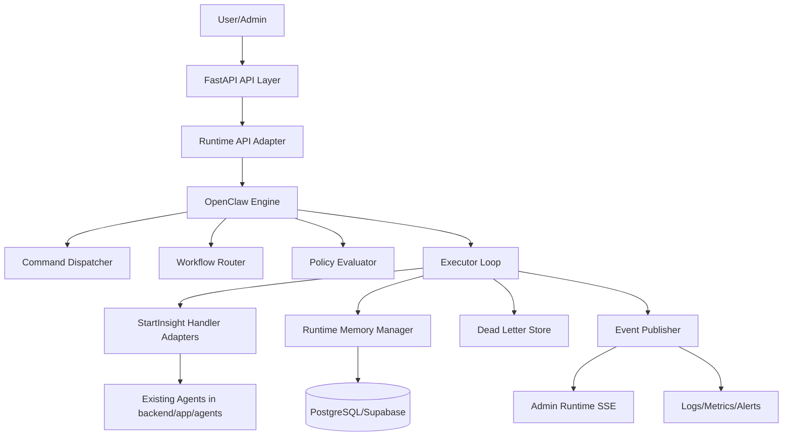

---
**Memory Bank Protocol**
**Reading Priority:** CRITICAL
**Read When:** Before runtime implementation, schema migrations, and operational rollout
**Dependencies:** `memory-bank/version2/project-brief-v2.md`, `memory-bank/version2/implementation-plan-v2.md`
**Purpose:** Canonical V2 architecture for OpenClaw-based runtime, compatibility, and migration
**Last Updated:** 2026-02-17
---

# Architecture V2: StartInsight OpenClaw Runtime Architecture

## 1. Architecture Intent
V2 establishes a single execution control plane by integrating OpenClaw directly and routing all agent execution through StartInsight runtime adapters.

The runtime becomes authoritative for:
- command lifecycle and idempotency
- workflow orchestration and transitions
- retry, timeout, dead-letter, and replay policy execution
- scoped memory persistence
- execution telemetry and forensic lineage

## 2. Current vs Target Ownership
| Concern | V1 (Current) | V2 (Target) |
|---|---|---|
| Scheduling | APScheduler in `backend/app/tasks/scheduler.py` | Runtime-triggered workflow ownership via OpenClaw adapter |
| Background execution | Arq functions and cron in `backend/app/worker.py` | OpenClaw command executor loop |
| Agent invocation | Direct task/service/route execution paths | Runtime handler adapters |
| Control APIs | `backend/app/api/routes/agent_control.py` + route-specific triggers | Canonical `/admin/runtime/*` APIs |
| Retry semantics | Path-specific logic | Central policy engine profiles |
| Replay | Limited/manual per path | First-class dead-letter + replay flow |

## 3. System Context
### Existing product boundary (preserved)
- Frontend: Next.js App Router (`frontend/app/`)
- Product APIs: FastAPI routers mounted in `backend/app/main.py`
- Domain persistence: SQLAlchemy models and Alembic migrations

### New runtime boundary (added)
- Runtime package: `backend/app/runtime/`
- OpenClaw engine integration layer
- Runtime persistence tables in PostgreSQL/Supabase
- Runtime event stream for admin operations

## 4. Target Component Architecture

## 5. Runtime Module Design (`backend/app/runtime/`)
Required modules:
- `openclaw_adapter.py`: wraps OpenClaw primitives and lifecycle hooks.
- `contracts.py`: canonical schemas for command/workflow/memory/event envelopes.
- `dispatcher.py`: command intake, validation, idempotency.
- `executor.py`: dequeue, execute, persist outcomes, emit events.
- `workflow_router.py`: step transitions, block/partial/fail/resume behavior.
- `policies.py`: retry/backoff/timeout/dead-letter rules.
- `memory.py`: scope state reads/writes, versioning, TTL enforcement.
- `events.py`: lifecycle event formatter/publisher.
- `handlers/`: agent-specific adapters for current V1 agents.

## 6. Handler Adapter Strategy
Each existing agent path is wrapped, not rewritten.

### Primary adapter families
- `enhanced_analyzer` adapter
- `research_agent` adapter
- `chat_agent` adapter
- `content_generator` adapter
- `competitive_intel` adapter
- `market_intel` adapter
- `market_insight_publisher` adapter
- `quality_reviewer` adapter

### Adapter responsibilities
1. Translate runtime command payload into existing function call contract.
2. Normalize outputs into runtime result envelope.
3. Normalize exceptions into runtime error classes.
4. Emit command-level metrics (latency, token usage, cost).
5. Preserve existing domain persistence behavior.

## 7. Canonical Runtime Contracts
## 7.1 Command contract
Required fields:
- `id`
- `command_type`
- `status`
- `payload_json`
- `policy_profile`
- `workflow_run_id` (nullable)
- `idempotency_key`
- `attempt_count`
- `max_attempts`
- `last_error_class`
- `last_error_message`
- `created_at`
- `updated_at`

## 7.2 Attempt contract
Required fields:
- `id`
- `command_id`
- `attempt_number`
- `started_at`
- `completed_at`
- `duration_ms`
- `error_class`
- `error_message`
- `result_summary_json`
- `token_usage_json`
- `cost_usd`

## 7.3 Workflow contract
Required fields:
- `id`
- `workflow_name`
- `status`
- `current_step`
- `step_index`
- `total_steps`
- `trigger_source`
- `trigger_actor`
- `started_at`
- `completed_at`

## 7.4 Memory contract
Required fields:
- `id`
- `scope_type` (`run_scope`, `agent_scope`, `user_scope`)
- `scope_key`
- `state_json`
- `version`
- `expires_at`
- `created_at`
- `updated_at`

## 8. Runtime State Machines
## 8.1 Command lifecycle
`queued -> running -> succeeded`

Failure path:
`running -> retry_scheduled -> queued`

Terminal path:
`running -> failed_terminal -> dead_lettered`

Replay path:
`dead_lettered -> replay_requested -> queued`

## 8.2 Workflow lifecycle
`pending -> active -> completed`

Alternative paths:
- `active -> blocked`
- `active -> partial`
- `active -> failed_terminal`
- `failed_terminal -> replay_active -> active`

## 9. Data Model Additions
### New runtime tables
- `runtime_commands`
- `runtime_command_attempts`
- `runtime_workflow_runs`
- `runtime_memory_snapshots`
- `runtime_dead_letters`

### Indexing requirements
- command status + created_at
- command type + status
- workflow id + current step
- dead-letter status + created_at
- memory scope_type + scope_key + version

### Existing table role updates
- `agent_execution_logs`: projection and audit output, not canonical runtime state.
- `agent_configurations`: source for schedule/policy defaults and rollout controls.

## 10. API and Interface Additions
## 10.1 Admin runtime mutation APIs
- `POST /admin/runtime/commands`
- `POST /admin/runtime/workflows/{name}/trigger`
- `POST /admin/runtime/dead-letters/{id}/replay`

## 10.2 Admin runtime read APIs
- `GET /admin/runtime/commands/{id}`
- `GET /admin/runtime/commands`
- `GET /admin/runtime/workflows/{id}`
- `GET /admin/runtime/events` (SSE)

## 10.3 Compatibility policy
Product-facing routes remain unchanged during V2. Runtime APIs are additive and admin-scoped.

## 11. Security and Governance
1. Runtime mutation APIs require admin authorization.
2. Replay operations require idempotency key and actor audit stamp.
3. Runtime payload size limits and schema validation are enforced at ingress.
4. Every state transition writes an auditable event with trace identifiers.

## 12. Observability and Forensics
### Mandatory event types
Command events:
- created
- started
- succeeded
- failed
- retried
- dead_lettered
- replay_requested
- replay_succeeded

Workflow events:
- started
- step_changed
- blocked
- partial
- completed
- failed
- replay_started
- replay_completed

### Trace guarantees
- Every attempt is linkable to command and workflow.
- Every runtime event includes request id, actor/source, and timestamps.
- LLM cost attribution is emitted at attempt level and aggregatable at workflow level.

## 13. Failure Modes and Handling
| Failure Mode | Detection | Runtime Response |
|---|---|---|
| Transient provider/network error | Adapter error class | Retry by policy profile |
| Deterministic validation failure | Adapter validation error class | Mark terminal and dead-letter |
| Timeout | Executor timeout budget exceeded | Retry or dead-letter per profile |
| Queue backlog spike | Queue lag metric and alert | Concurrency throttling and escalation |
| Replay failure | Replay event stream and metrics | Keep dead-letter state and emit incident signal |

## 14. Migration Topology
## 14.1 Shadow phase
- Runtime executes commands/workflows in non-authoritative mode.
- Legacy outputs remain source of truth.
- Variance dashboards collect parity evidence.

## 14.2 Controlled cutover
- Feature flags shift selected workflows to runtime ownership.
- Legacy scheduler ownership is disabled only for migrated workflows.
- 14-day stability window required before next phase.

## 14.3 Legacy decommission
- Remove legacy ownership paths after secondary migrations pass.
- Keep rollback-safe switch until G7 sign-off.

## 14.4 Rollback model
- Fast ownership switch back to legacy path.
- Preserve runtime records for postmortem and replay analysis.

## 15. Non-Functional Targets
- Workflow completion reliability: >99.0%
- Command trace coverage: 100%
- MTTR improvement: >=50%
- Replay success for eligible dead letters: >=95%

## 16. Architecture Acceptance Criteria
1. Runtime package ownership is explicit and non-ambiguous.
2. All primary agent families have adapter contracts and test coverage.
3. Runtime APIs and state transitions are fully auditable.
4. Migration and rollback mechanics are proven in staged drills before production cutover.

## 17. Document Control
- **Owner:** Platform Architecture + Runtime Team
- **Review Cadence:** Weekly during migration, monthly after stabilization
- **Related Docs:**
  - `memory-bank/version2/project-brief-v2.md`
  - `memory-bank/version2/tech-stack-v2.md`
  - `memory-bank/version2/implementation-plan-v2.md`
